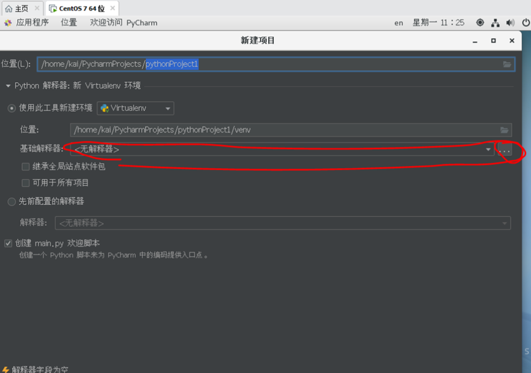

[toc] 在虚拟机上安装 pycharm 并配置环境

# 1.使用虚拟机自带的 python2.7 环境

使用 wget 指令从 pycharm 官网下载 pycharm 压缩包 
`wget https://download.jetbrains.com/python/pycharm-community-2024.2.4.tar.gz`

解压缩: `tar -xzvf pycharm-community-2024.2.4.tar.gz`

打开终端，进入文件的 bin 目录，运行. pycharm.sh 命令

点击 new 新建项目，将图中所示解释器选为虚拟机的 bin 目录下自带的 Python2.7

下载 get-pip.py:

`wget https://bootstrap.pypa.io/get-pip.py`

> \*如果显示版本过低而报错可以尝试下载 2.7 版本的 pip（因为 Python 2.7 不再得到官方支持，下载的链接可能已经失效）。
> `wget https://bootstrap.pypa.io/pip/2.7/get-pip.py(2.7 版本)`

说明：
因为 Python 2.7 已经在 2020 年停止支持，推荐你尽可能使用 Python 3.x。如果你能安装 Python 3.x，那么你可以使用更新版的 pip 来进行包管理。
sudo yum install python3 安装 Python 3（如果尚未安装）
sudo yum install python3-pip 安装 Python 3 的 pip
pip3 –version 确认是否安装成功

如果无法通过 yum 下载软件包可能是由于网络连接问题或配置的镜像源不可用，以下给出几种解决方案：

1. 检查网络连接
   首先检查虚拟机的网络连接是否正常。你可以尝试使用以下命令来检查网络连接：
   ping.baidu.com
   如果无法连接，可能需要调整网络配置，确保虚拟机能够访问外部网络。

2. 更换镜像源
   如果网络连接正常，但仍然无法访问 CentOS 的镜像源，你可以尝试更换镜像源。编辑 /etc/yum.repos.d/CentOS-Base.repo 文件，修改镜像源地址为其他可用的镜像。
   例如：sudo vi /etc/yum.repos.d/CentOS-Base.repo
   将 mirrorlist=http://mirrorlist.centos.org/ 替换为 baseurl=http://vault.centos.org/centos/7.9.2009/os/x86_64/。

3. 禁用镜像源
   如果你暂时不需要安装更多软件包，可以选择禁用出现问题的仓库，然后继续安装软件：
   sudo yum --disablerepo=base -y install python3

4. 使用离线安装
   如果你无法解决镜像源的问题，可以尝试在其他机器上下载 Python 3 的安装包，使用 U 盘等方式将其传输到虚拟机上进行手动安装。

5. 使用 dnf（如果可用）
   CentOS 8 及以上版本默认使用 dnf 替代 yum。如果你的系统是基于 CentOS 8 或更高版本，可以尝试：
   sudo dnf install python3
   如果没有 dnf，则可以尝试按照上面的方法进行配置

运行脚本安装 pip:
python get-pip.py 对于 Python 2.x
python3 get-pip.py 对于 Python 3.x

如果想创建快捷方式可以创建一个脚本文件
nano ~/桌面/pycharm.desktop
进入文件并写入脚本
[Desktop Entry]
Version=1.0
Name=PyCharm
Comment=PyCharm IDE
Exec=/home/1204/桌面/pycharm-community-2024.2.4/bin/pycharm.sh
Icon=/home/1204/桌面/pycharm-community-2024.2.4/bin/pycharm.png
Terminal=false
Type=Application
Categories=Development;IDE; \*注意 Exec 和 Icon 部分要写入自己的文件路径
通过 chmod +x 给 pycharm.desktop 文件添加执行权限
chmod +x ~/桌面/pycharm.desktop
pip 下载速度可能太慢建议使用镜像源：
创建全局配置文件
nano ~/.pip/pip.conf
在文件中写入镜像源脚本
[global]
index-url = https://pypi.tuna.tsinghua.edu.cn/simple
保存并退出
2 创建虚拟环境
若想要创建虚拟环境需要确保虚拟机中安装了 python3，python2.7 已经停止支持，很多现代的 python 工具和库都只支持 python3 1.首先确保虚拟机中安装了 python3
sudo yum install python3 2.安装 virtualenv，可以通过 pip3 安装 virtualenv
sudo yum install python3-pip
pip3 install virtualenv（或者 sudo pip3 install virtualenv）

（pip 需要加入到环境变量中:echo 'export PATH=$PATH:/root/.local/bin' >> ~/.bashrc source ~/.bashrc） 3. 创建虚拟环境
virtualenv myenv 4. 激活虚拟环境
source myenv/bin/activate
python3 已经自带了 venv 模块，它也可以用来创建虚拟环境，不需要额外安装任何安装包： python3 -m venv myenv

5，退出虚拟环境
deactivate 3.创建 conda 环境 1.安装 Miniconda（更轻量版的 conda）
wget https://repo.anaconda.com/miniconda/Miniconda3-latest-Linux-x86_64.sh \*也可以下载完整的 anaconda 发行版：
wget https://repo.anaconda.com/archive/Anaconda3-2023.09-Linux-x86_64.sh

2.运行安装脚本
bash Miniconda3-latest-Linux-x86_64.sh
\*bash Anaconda3-2023.09-Linux-x86_64.sh

3.初始化 conda
source ~/miniconda3/bin/activate
\*source ~/anaconda3/bin/activate

4.创建虚拟环境
conda create --name myenv python=3.6

5.激活虚拟环境
conda activate myenv

6.退出虚拟环境
conda deactivate

如果想再次进入虚拟环境可以使用：source <环境路径>/bin/activate（例如：source /home/1204/myenv/bin/activate）或者如果已经在正确的目录中可以直接激活虚拟环境：activate myenv）
再次进入 conda 环境：conda activate <环境名> （例如：conda activate mycondaenv）

说明（可能遇见的问题）：
“Cannot find a valid baseurl for repo: base/7/x86_64“ 出现此类报错可能是 centos 无法访问默认的 mirrorlist.centos.org，可能是网络连接问题或者 DNS 配置不正确导致无法获取软件包仓库的镜像列表
解决方案：

1. 检查网络连接：首先确认服务器能连接到互联网，可使用 ping 命令；来测试与外部服务器的链接，若不能链接检查网络设置（例如 DNS 配置，网关等）确保服务器有正确的网络访问权限，可以检查网络接口：ip addr show ens33 尝试重启：
   sudo ifdown ens33
   sudo ifup ens33
2. 更换镜像源
   备份现有的仓库配置文件 sudo cp /etc/yum.repos.d/CentOS-Base.repo /etc/yum.repos.d/CentOS-Base.repo.bak
   编辑/etc/yum.repos.d/CentOS-Base.repo 文件（sudo vi /etc/yum.repos.d/CentOS-Base.repo），找到 [base]、[updates] 和其他仓库部分，将其 mirrorlist 行替换为 baseurl，mirrorlist 行注释掉，并指定一个可用的镜像源，将 gpgkey 改为一个可用镜像源。例如，使用阿里云的 CentOS 镜像源：http://mirrors.aliyun.com/centos/7/os/x86_64/

3. 修改 DNS 配置
   打开/etc/resolv.conf 文件：sudo vi /etc/resolv.conf
   在文件中添加 Google 公共 DNS 服务器
   nameserver 8.8.8.8
   nameserver 8.8.4.4
   保存并关闭文件然后再次尝试更新：sudo yum update
   可以测试 DNS 解析是否正常：nslookup mirror.centos.org 或者
   dig mirror.centos.org
   如果对 DNS 配置做了更改可以重启 NetworkManager 服务来应用新的配置：
   sudo systemctl restart NetworkManager
   “http://mirror.centos.org/centos/7/extras/x86_64/repodata/repomd.xml: [Errno 14] HTTP Error 404 - Not Found“ 若出现这类报错可以临时禁用 extras 仓库：
   sudo yum --disablerepo=extras update
   sudo yum-config-manager --disable extras（永久禁用，自行选择使用）
   然后再次运行更新
4. 检查防火墙设置
   如果有防火墙规则可能阻止外部连接如果防火墙是启用状态可以尝试暂时关闭它来排除问题
   sudo firewall-cmd –state 检查防火墙状态
   sudo systemctl stop firewalld 关闭防火墙
   *5.检查是否有代理设置
   有时系统可能配置了代理，导致无法访问外部网络。检查环境变量是否存在代理配置：echo $http_proxy echo $https_proxy
   如果有代理设置，可能需要暂时禁用它，或者更新代理设置以允许访问 CentOS 镜像。
   *6.解决内存问题
   在 VMware 中增加磁盘：关闭虚拟机、修改磁盘大小、启动虚拟机 1.确认磁盘空间是否已增加： 确保你已在 VMware 或虚拟机管理工具中增加了磁盘大小。你可以通过 lsblk 或 fdisk -l 查看新磁盘空间是否可用，查看磁盘和分区信息：
   sudo lsblk
   sudo fdisk -l
5. 扩展物理卷（如果磁盘空间已增加）： 假设你已经增加了磁盘容量并确认空间已增加，那么你需要扩展物理卷（PV）：
   sudo partprobe
   然后扩展物理卷：
   sudo pvresize /dev/sda2 这里的 /dev/sda2 是设备分区路径，通常你需要查看系统中的磁盘分区，并修改为实际的分区路径。例如，使用 lsblk 或 fdisk -l 命令查看你的磁盘分区，可能是 /dev/sdb1, /dev/nvme0n1p1 等。
6. 扩展逻辑卷：扩展物理卷后，接下来需要扩展逻辑卷。
   sudo lvextend -l +100%FREE /dev/centos/root /dev/centos/root 是逻辑卷的路径，通常是根据你的卷组（Volume Group，VG）和逻辑卷（LV）名称来设定的。你可以使用 lvdisplay 或 vgs 命令查看你的卷组和逻辑卷，确保路径正确。（下同）
   这样会将所有可用的空闲空间分配给根逻辑卷。
7. 扩展文件系统：最后，扩展文件系统以使用新扩展的空间，如果文件系统是 XFS 使用 xfs_growfs 命令：sudo xfs_growfs /dev/centos/root （如果使用的是 ext4 文件系统可以使用：sudo resize2fs /dev/centos/root）可以使用 df -h 验证空间变化
   如果物理卷未自动扩展：
8. 扩展分区
   删除现有分区（不丢失数据）：因为磁盘已经扩展，我们需要通过调整分区表来让 sda2 使用所有可用空间。执行以下步骤前，请确保你已经备份了重要数据（虽然操作过程中数据不应该丢失，但最好小心为妙）。运行 fdisk 来调整分区大小：sudo fdisk /dev/sda
   然后依次执行以下命令：
   输入 p 查看当前分区表。
   输入 d 删除分区 /dev/sda2。
   输入 n 创建新的分区，类型选择 8e（Linux LVM），并确保将分区大小设置为 （自己设置的大小）。
   输入 w 保存更改并退出。
9. 重新扫描分区
   重新分区后，你需要让操作系统识别新的分区表。可以使用以下命令重新扫描磁盘：sudo partprobe
10. 扩展物理卷（PV）
    分区调整后，扩展物理卷来使用新的空间：sudo pvresize /dev/sda2
    这会扩展物理卷，允许它使用新的分区空间。
11. 扩展逻辑卷（LV）
    sudo lvextend -l +100%FREE /dev/centos/root
12. 扩展系统文件
    最后，扩展 XFS 文件系统来使用新的空间：
    sudo xfs_growfs /dev/centos/root
